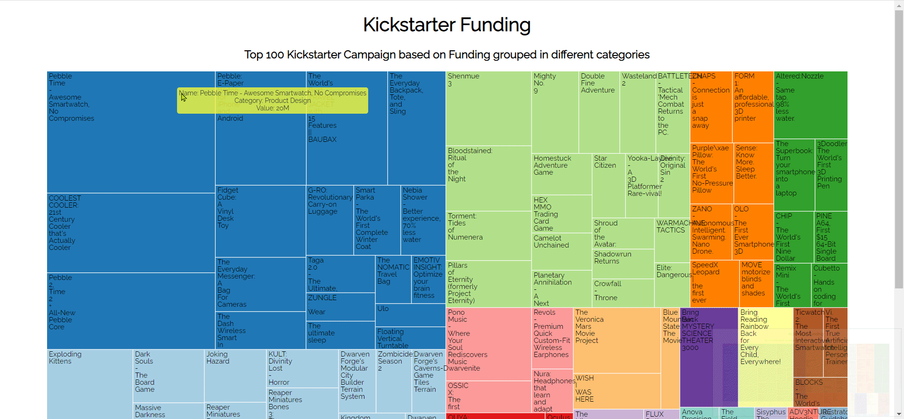

# D3 Tree Map - Top 100 Kickstarter campaigns

This tree map shows top 100 Kickstarter campaigns based on their funding. They are grouped by different categories in different colors. When you hover over a tile you will see a toolitp that will give more information about that kickstarter campaign.

This chart was build using d3 js library.

You can customize this graph using your own dataset. For that, structure the dataset in the same way as the json file in the url variable in script.js file.

Two other datasets are given as comments. You can use them for the tree map just by replacing the url variable with those links.But you have to change the title and description for the same.

**Attribution**: This chart is an exact replica of freecodecamp project at the url: [https://treemap-diagram.freecodecamp.rocks/](https://treemap-diagram.freecodecamp.rocks/) and it was done as a part of coursework of data visualisation on freecodecamp.

Checkout the deployed app at the url: 

A Pen created on CodePen.io. Original URL: [https://codepen.io/sathishkannan/pen/GRddVPP](https://codepen.io/sathishkannan/pen/GRddVPP).

